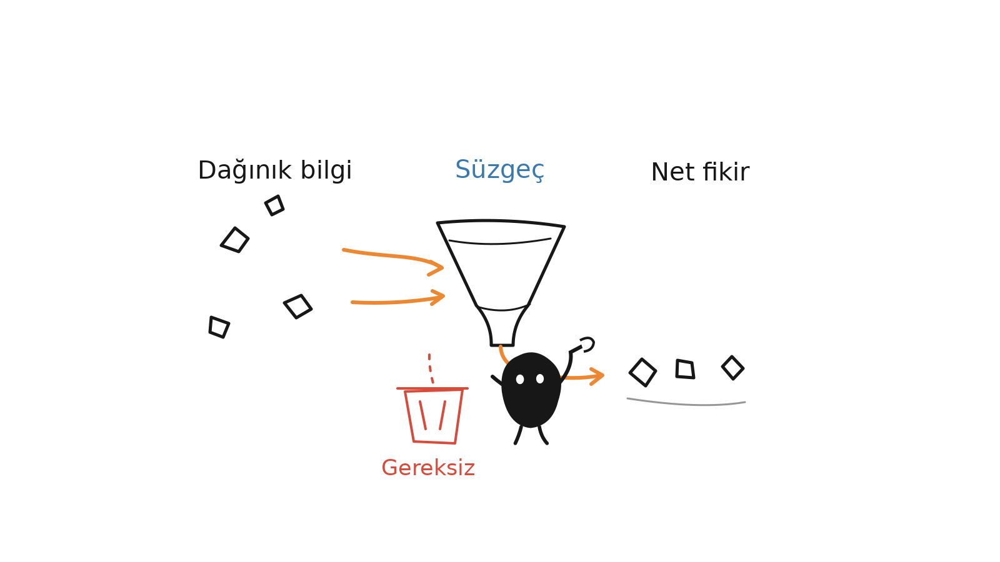
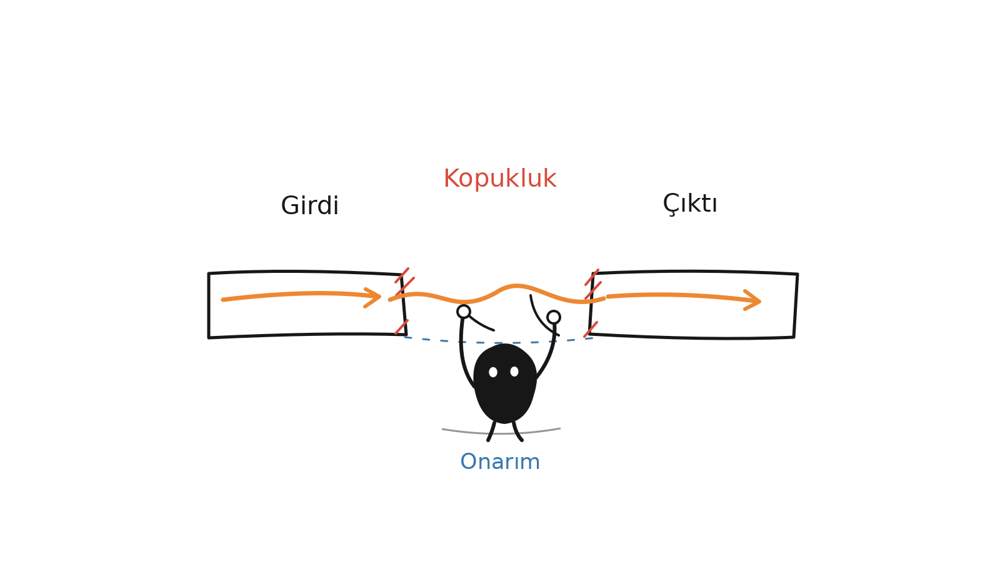
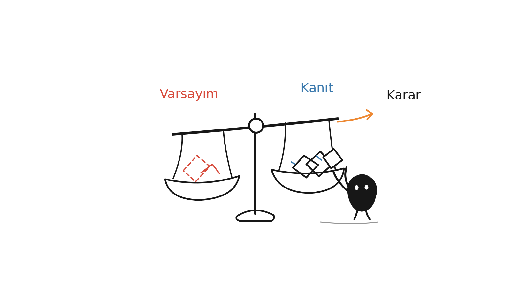
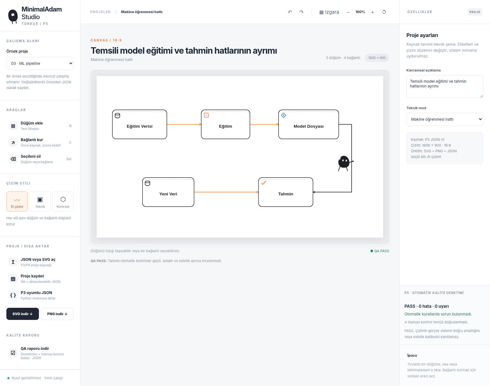
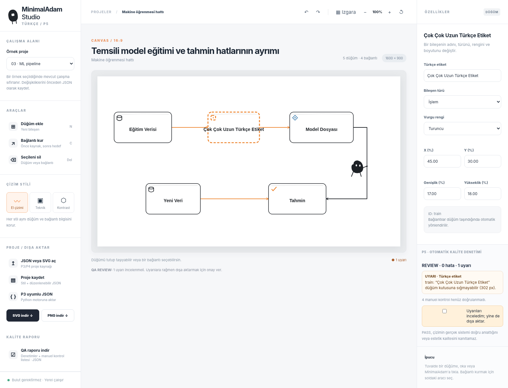

# MinimalAdam — Türkçe İllüstrasyon ve Teknik Şema Stüdyosu (v0.6.1)

> Türkçe makale, blog, not ve fikirlerden; beyaz zeminli, el çizimi hissi taşıyan, hafif sıra dışı açıklayıcı illüstrasyonlar üretmek için Codex Skill.
>
> **16:9 yatay · MinimalAdam karakteri · Saf beyaz zemin · Az miktarda kırmızı/turuncu/mavi vurgu · Türkçe etiketler**

**Türetildiği özgün çalışma:** [Ian Xiaohei Illustrations — helloianneo](https://github.com/helloianneo/ian-xiaohei-illustrations) (Ian).  
**Bu paket:** Türkçeye uyarlanmış Skill + P1 özgün örnek sahneleri + P2 ayrı yazı katmanı aracı + P3 teknik çizim motoru + P4 yerel görsel editör + P5 otomatik kalite kapısı. Kaynak projenin MIT lisansı ve yaratıcısına atıf korunur. Bu paket, Ian'ın resmî sürümü değildir.

## Proje nedir?

Özgün çalışma, Codex'e yüklenen **AI ajan becerisi (Skill)** paketidir. Bu Türkçe uyarlama, P4 ile tarayıcı tabanlı **ayrı bir teknik şema editörü** de içerir. Ancak bağımsız görüntü üretim modeli içermez. Türkçe makalelerdeki önemli kararları, akışları, durumları ve kavramsal ilişkileri seçerek, anlaşılır ama sıradan olmayan açıklayıcı resimlere dönüştürmeyi amaçlar.

Varsayılan karakterimiz **MinimalAdam**, özgün Xiaohei görsel dilinden uyarlanmış siyah gövdeli, beyaz gözlü ve ince bacaklı bir figürdür. Özgün karakterin yaratıcısı Ian'dır ve haklarına ilişkin atıf `NOTICE.md` dosyasında korunur. Sahnede dekor değil, ana işi yapan katılımcı olmalıdır.

**Temel ilke:** Metne bir görsel eklemek yerine, metindeki tek bir düşünme eylemini görünür kıl.

## Kimler için uygun?

Türkçe makale, eğitim amaçlı kısa anlatı, yöntem belgesi, blog yazısı, ürün süreci veya AI iş akışı hazırlayanlar; soyut fikirleri somut görsel mecazlarla açıklamak isteyenler; tutarlı bir karakter ve çizim diliyle içerik üretenler.

Serbest illüstrasyon yolu, kapsamlı UML veya CAD şemaları için uygun değildir. **P3 teknik mod** 2–8 düğümlü kaynak tanımlı mimari, veri akışı, ML pipeline ve geri besleme şemaları üretebilir. P4 ile sınırlı teknik şema editörü, P5 ile otomatik QA kapısı eklendi; gerçek uygulama ekranı, CAD ve simülasyon kapsam dışıdır.

## Neler üretir?

- Türkçe metnin uygun noktaları için yaklaşık **4–8 görsellik çizim listesi**; kısa metinlerde daha az.
- Her görselin konusu, tek ana fikri, yapı türü, MinimalAdam eylemi ve Türkçe etiketleri.
- Görüntü oluşturma aracı kullanılabiliyorsa ayrı ayrı 16:9 PNG illüstrasyonlar.
- İstenen görselde kısa yazıyı kaldırmak, MinimalAdam'nin rolünü güçlendirmek veya Türkçe etiket hatasını düzeltmek için düzenleme istemleri ve P2 JSON/şeffaf katman yeniden render akışı.

Serbest kavram illüstrasyonları için bir görüntü üretim modeli içermez. Ancak üç özgün **örnek sahne**, P2 yazı katmanı ve P3 için çalışan **deklaratif SVG/PNG teknik çizim motoru** pakete dahildir. Yeni serbest sahneler için yine bir görüntü üretim modeli veya manuel SVG çizimi gerekir.

## Görsel dil

- Düz ve saf beyaz arka plan; gölge ve kâğıt dokusu yok.
- Siyah, ince ve hafif düzensiz el çizimi çizgiler.
- Tuvalin yaklaşık %40–60'ında ana sahne; en az %35 boş alan.
- Ana akış için az turuncu, kritik vurgu için az kırmızı, ikincil bilgi için az mavi.
- Bir görselde **tek** ana ilişki veya eylem.
- MinimalAdam ana işi kendisi yapar; maskot gibi köşede durmaz.
- Kısa, doğru yazılmış **Türkçe** etiketler; yabancı dilde rastgele başlık yok.

## P1 — Üç özgün Türkçe örnek

Bu paket içinde özgün Ian örnekleri kopyalanmadan hazırlanan üç yeni 16:9 sahne bulunur. Aynı kaynak MinimalAdam gövde sembolü kullanılır, her çizimde ayrı bir iş yapar. Türkçe sözcükler daha sonra P2 katmanı ile eklenir.







Yazısız SVG tabanlar: `examples/specs/*.base.svg`, etiketler: `examples/specs/*.labels.json`, oluşturulan dört parçalı çıktılar: `examples/generated/`. Bu sahneler örnek uygulamadır; her yeni konuyu aynı çizimle anlatmak yerine özgün mecaz geliştirilir.

## P2 — Türkçe metni ayrı katmana yerleştirme

Yeni üretim sırası: **yazısız 16:9 temel sahne → kısa Türkçe etiket JSON'u → font/glif ve yerleşim denetimi → şeffaf yazı katmanı → nihai PNG + manifest**. Çizim modelinin Türkçeyi doğru yazacağını varsaymayız. Türkçe glifler gerçek bilgisayar fontundan alınır.

Kurulum: `python -m pip install -r requirements.txt`

```bash
python tools/render_turkish_labels.py --base examples/generated/01-bilgiyi-suz.base.png --labels examples/specs/01-bilgiyi-suz.labels.json --output ornek.png
```

Windows için aynı komutu `py -3` ile başlatabilirsin. Ayrıntılar ve JSON şeması: [Türkçe yazı katmanı rehberi](minimaladam/references/turkish-text-layer.md).

Not: Font dosyası dağıtılmaz; gerçek sistem fontu kullanılır. Kod yalnızca etiketin varlığını, glifleri, konum sınırlarını ve **etiketler arası** çakışmayı doğrular; çizimdeki nesnelerle çakışmayı ve kavramsal doğruluğu ayrıca görsel olarak kontrol et.

## P3 — Teknik çizim modu

Genel illüstrasyondan farklı olarak, **kaynağı belirtilen bir sistemi** temiz ve teknik olarak okunabilir bir şemaya dönüştürür. Aşağıdaki dört mod vardır:

| Mod | Teknik odak | SVG/PNG örneği |
|---|---|---|
| `architecture` | Yazılım bileşenleri ve yönlü bağlantılar | [Mimari](examples/technical/generated/01-yazilim-mimarisi.png) |
| `data-flow` | Veri dönüşüm hattı | [Veri akışı](examples/technical/generated/02-veri-akisi.png) |
| `ml-pipeline` | Eğitim ve tahminin ayrılması | [ML hattı](examples/technical/generated/03-ml-pipeline.png) |
| `engineering-system` | Ölçme, denetim, eylem ve geri besleme | [Mühendislik şeması](examples/technical/generated/04-muhendislik-sistemi.png) |

Şemalar doğrudan **gerçek verisi sağlanan node ve edge** tanımlarından üretilir. Yeni servis uydurulmaz. Çıktılar: yazısız vektör tabanı (`.base.svg`), yalnız Türkçe etiket (`.labels.svg`), düzenlenebilir tam `.svg`, 1600×900 `.png` ve QA manifest (`.manifest.json`). SVG/P2 katmanları birbirinden ayrıdır. Açık kaynak font sistemi kullanılır; **font dosyası dağıtılmaz**.

Örnek çalıştırma:

```powershell
python -m pip install -r requirements.txt
python .\tools\render_technical_diagram.py --spec .\examples\technical\specs\03-ml-pipeline.json --output-dir .\outputs\teknik
```

Codex içine kurulunca da `minimaladam/scripts/` içinde aynı araçlar ve örnek teknik JSON dosyaları bulunur. Ayrıntılı şema sözlüğü ve sınırlar: [P3 teknik mod rehberi](minimaladam/references/technical-mode.md) · [Örnek şemalar](examples/technical/README.md).

**P3 motorunun sınırlaması:** Otomatik düğüm yerleşimi, CAD, simülasyon, sistem mimarisini kaynak koddan çıkartma ve ok-ok kesişmelerini her durumda çözme yoktur. P3 SVG dosyası vektör olarak düzenlenebilir; P4 görsel editör P3 JSON kaynakları ve kendi ürettiği metadata içeren SVG dosyalarıyla çalışır. Örnekler **temsili**, kaynak depoya ait gerçek mimari değildir.

## P4 — MinimalAdam Studio: Yerel görsel editör

Bu sürümde, mevcut sade illüstrasyon dilini koruyan **çalışan bir çevrimdışı teknik şema editörü** bulunur. Harici API, ücretli abonelik veya bulut hizmeti gerekmez.

**En hızlı kullanım (Windows):** ZIP dosyasını aç → **`MinimalAdam-Studio.cmd`** dosyasına çift tıkla. Ya da `editor/offline.html` dosyasını Edge / Chrome / Firefox ile aç. Bu tek dosyalık sürüm için Python, Node veya sunucu gerekmez.



| İşlem | Kullanım |
|---|---|
| Düğüm ekle / taşı / sil | Soldaki düğüm aracı, tuvalde sürükleme ve sağ özellikler |
| Bağlantı oluştur ve düzenle | Solda “Bağlantı kur”, iki düğüme tıkla; sonra bağlantının özelliklerini düzenle |
| Türkçe etiket, renk, boyut | Sağdaki özellik panelinde değiştir |
| Üç stil | El çizimi / Teknik / Kontrast |
| Geri al / ileri al | Ctrl+Z / Ctrl+Shift+Z veya üstteki oklar |
| İçe aktar | P3 JSON v1, P4 `.project.json`, P4 metadata SVG, sınırlı eski P3 SVG |
| Kaydet / dışa aktar | Proje JSON, P3 JSON, tam SVG, 1600×900 PNG |

**P4 SVG tekrar düzenlenebilir:** SVG çıktısı, yalnız vektörel şekilleri değil, editörün tam kaynak şemasını ve stil bilgisini de XML metadata içinde tutar. Dosyayı tekrar yüklediğinde düğüm, bağlantı ve etiketleri yeniden düzenleyebilirsin. P3'ün **eski** SVG'lerinde tüm semantik metadata olmadığı için orijinal JSON tercih edilmeli; eski SVG kurtarma deneyseldir ve doğrulama gerektirir.

**Kurulum ve test:** [P4 görsel editör rehberi](minimaladam/references/visual-editor.md). Yazılımın modern tarayıcıda çalışması yeterli; kod geliştiricileri isterse `python tools/start_studio.py` ile yalnız localhost'a bağlanan bir sunucu kullanabilir.

**Sınır:** Bu bir serbest çizim/CAD programı değildir. Karmaşık otomatik graf yerleşimi ve SVG'deki her nesneyi bağımsız çizim nesnesi gibi dönüştürme henüz yoktur. Manuel `via` ara noktaları, geometri uyarıları ve P3 JSON uyumluluğu vardır; otomatik doğruluk garantisi yoktur.

## P5 — Otomatik görsel kalite kontrolü (yeni)

P4 editörünün sağ panelindeki **P5 otomatik kalite denetimi**, çizimi her düzenlediğinde kontrol eder. Düğüme sığmayan Türkçe etiketler, kesişen oklar, başka kutuları delen bağlantılar, bağlantısız düğümler, MinimalAdam'nin okla temas uzaklığı ve bazı yerleşim sorunları ayrı uyarılarla gösterilir. **QA raporu indir** komutu, ölçümleri ve sorunları JSON dosyasına kaydeder.

- **PASS:** Tanımlı otomatik kurallardan geçti. Teknik veya estetik doğruluk garantisi değildir.
- **REVIEW:** İncelenecek uyarı var. SVG/PNG/JSON dışa aktarmak için uyarıları açıkça onaylamak gerekir; çizim değiştirilirse onay sıfırlanır.
- **FAIL:** Kaynak JSON şemasında hata var; dışa aktarma engellenir.

İlave **PNG kalite denetleyicisi** için yalnız Python ve Pillow gereklidir. 1600×900 boyut, beyaz alan, köşe temizliği, izinli renk paleti, tamamen boş görüntü ve yaklaşık çizim yoğunluğunu kontrol eder:

```powershell
python .\tools\inspect_render.py .\examples\technical\generated\03-ml-pipeline.png --report .\outputs\qa-raporu.json
```

**Dikkat:** OCR, Türkçe imla, gerçek sistem mimarisi, çizim estetiği ve özgün karakter benzerliği otomatik kanıtlanmaz. Manuel kontrol maddeleri indirilen raporda `NOT_VERIFIED` olarak kalır. Teknik QA yalnız kaynak tanımlı P3/P4 şemalarına; PNG raster QA ayrıca P1/P2 örneklerine de uygulanabilir.

P5 dokümanı: [Otomatik kalite kapısı rehberi](minimaladam/references/quality-gate.md) · [P5 negatif test ve rapor örnekleri](examples/qa/README.md).



## Özgün depodaki örnekler

Aşağıdaki görseller **orijinal projeye aittir** ve Çince yazılar içerebilir. Bunlar Türkçeye dönüştürülmüş örnekler değil, stil kalibrasyonu için bağlantılardır. Yeni çizimlerde kopyalanmamalıdır.

| Özgün örnek | Kaynak görsel |
|---|---|
| İki kopma noktası | [Örneği aç](https://github.com/helloianneo/ian-xiaohei-illustrations/blob/main/examples/images/01-two-breakpoints.png) |
| Amaca göre ayırma | [Örneği aç](https://github.com/helloianneo/ian-xiaohei-illustrations/blob/main/examples/images/02-sort-by-purpose.png) |
| Tek kaynaktan farklı çıktılar | [Örneği aç](https://github.com/helloianneo/ian-xiaohei-illustrations/blob/main/examples/images/03-one-fish-many-uses.png) |
| Aktarım yolu | [Örneği aç](https://github.com/helloianneo/ian-xiaohei-illustrations/blob/main/examples/images/04-handoff-path.png) |
| Bilgi kuyusu | [Örneği aç](https://github.com/helloianneo/ian-xiaohei-illustrations/blob/main/examples/images/05-information-well.png) |
| Fikir presi | [Örneği aç](https://github.com/helloianneo/ian-xiaohei-illustrations/blob/main/examples/images/06-idea-press.png) |
| İçeriğin olgunlaşması | [Örneği aç](https://github.com/helloianneo/ian-xiaohei-illustrations/blob/main/examples/images/07-content-fermentation.png) |
| Güven köprüsü | [Örneği aç](https://github.com/helloianneo/ian-xiaohei-illustrations/blob/main/examples/images/08-trust-bridge.png) |

## Kurulum

Bu paketi arşivden çıkar. Kurulması gereken klasör **`minimaladam/`** klasörüdür; depo kökünü doğrudan beceri klasörüne taşıma.

### Windows PowerShell

Arşivin açıldığı dizinde:

```powershell
powershell -ExecutionPolicy Bypass -File .\tools\install-codex.ps1
```

Veya el ile:

```powershell
$skills = if ($env:CODEX_HOME) { Join-Path $env:CODEX_HOME 'skills' } else { Join-Path $HOME '.codex\skills' }
New-Item -ItemType Directory -Force -Path $skills | Out-Null
Copy-Item -Recurse -Force .\minimaladam (Join-Path $skills 'minimaladam')
```

### macOS / Linux

```bash
mkdir -p "${CODEX_HOME:-$HOME/.codex}/skills"
cp -R ./minimaladam "${CODEX_HOME:-$HOME/.codex}/skills/"
```

### İsteğe bağlı: Özgün görsel örneklerini yerel olarak birleştir

Bu ZIP, Ian'ın özgün ikili örnek görsellerini içermez; P1 için hazırlanmış üç ayrı Türkçe örnek PNG içerir. Orijinal projeyi bilgisayarında klonlayıp özgün örnekleri **değiştirmeden** Türkçe beceri klasörüne kopyalayabilirsin:

```powershell
git clone https://github.com/helloianneo/ian-xiaohei-illustrations.git upstream-original
Copy-Item -Recurse -Force .\upstream-original\ian-minimaladam-illustrations\assets\examples\* .\minimaladam\assets\examples\
```

Özgün görsellerdeki Çince yazılar değişmez; Türkçe örnekler yukarıda gösterilen P1 sahneleridir.

## Kullanım

### Yalnızca görsel planı

```text
$minimaladam kullan. Görsel üretme.
Aşağıdaki Türkçe metnin görselleştirilmeye değer 5 ana noktasını seç.
Her birini yerleşim, konu, ana fikir, kompozisyon, MinimalAdam'nin eylemi ve kısa Türkçe etiketlerle açıkla.

<METİN>
```

### Dört bağımsız görsel üret

```text
$minimaladam kullanarak aşağıdaki Türkçe metinden dört ayrı 16:9 açıklayıcı görsel üret.
Saf beyaz zemin, el çizimi siyah çizgiler, az turuncu/kırmızı/mavi, kısa Türkçe etiketler ve ana işi yapan MinimalAdam kullan.
Her resim yalnızca bir ana fikri anlatsın; hiçbirini PPT slaydı gibi yapma.

<METİN>
```

### Tek kavram için görsel

```text
$minimaladam kullan.
"Güven, kanıtlar biriktikçe inşa edilir" düşüncesini tek 16:9 el çizimiyle anlat.
MinimalAdam, bu fikrin merkezi eylemini gerçekleştirsin. Görseldeki etiketler Türkçe olsun.
```

### Başlığı veya hatalı yazıyı kaldır

```text
$minimaladam kullan.
Ekli görselin sol üstündeki "Akış Şeması" yazısını kaldır; diğer bütün nesneleri ve çizgileri koru.
```

Başka komutlar: [examples/prompts.md](examples/prompts.md).

## Çalışma süreci

1. Türkçe metni ve bağlamını incele.
2. Görselden fayda sağlayan ana fikirleri seç.
3. Her fikir için yalnızca tek bir anlamsal odak içeren çizim listesi oluştur.
4. İş akışı, sistem kesiti, öncesi/sonrası, karakter durumu, kavramsal mecaz, yöntem katmanı, rota veya kısa çizgi roman türlerinden uygun olanını seç.
5. Önceki görselleri kopyalamadan yeni bir fiziksel mecaz kur.
6. MinimalAdam'yi bu mecazın merkezine yerleştir.
7. Kullanılabilir görüntü aracıyla her **yazısız** sahneyi ayrı üret.
8. JSON içindeki kısa Türkçe etiketleri P2 yazı katmanıyla uygula; glifleri, kırpılmayı ve metin çakışmasını denetle.
9. Görsel estetiği, özgünlüğü, metin-nesne ilişkisini manuel kontrol et.
10. Üretilen dosyaları gerçek konumlarıyla teslim et.

## Dosya yapısı

```text
ian-minimaladam-turkce-v0.4/
├── README.md, LICENSE, NOTICE.md, CHANGELOG.md
├── requirements.txt
├── editor/                  # P4 çevrimdışı HTML + JS/CSS + örnekler
├── MinimalAdam-Studio.cmd      # Windows hızlı başlatma
├── examples/
│   ├── prompts.md
│   ├── specs/                 # Yazısız SVG ve UTF-8 JSON etiketleri
│   ├── generated/             # Baz PNG / yazı katmanı / birleşik PNG / manifest
│   └── technical/             # P3 JSON kaynaklar + SVG/PNG/manifest
├── tests/test_p1_p2.py, test_p3.py, e2e_p4.py
├── tools/
│   ├── render_turkish_labels.py
│   ├── render_technical_diagram.py  # P3 teknik SVG motoru
│   ├── build_offline_editor.py     # P4 bağımsız HTML paketleyici
│   ├── start_studio.py             # İsteğe bağlı localhost geliştirici sunucusu
│   ├── make_samples.py
│   ├── install-codex.ps1
│   └── validate-package.py
└── minimaladam/
    ├── SKILL.md
    ├── agents/openai.yaml
    ├── editor/                # P4 kurulabilir offline.html ve kaynakları
    ├── assets/examples/       # 3 özgün Türkçe örnek + teknik örnek PNG
    ├── scripts/               # P2/P3 doğrudan çalıştırılabilir araçlar
    ├── examples/technical/    # P3 JSON kaynakları
    └── references/
        ├── style-dna.md
        ├── minimaladam-character.md
        ├── composition-patterns.md
        ├── prompt-template.md
        ├── qa-checklist.md
        ├── turkish-text-layer.md
        ├── technical-mode.md
        └── visual-editor.md
```

Testler:

```bash
python -m unittest discover -s tests -v
python tools/validate-package.py
node --test tests/js/p4_core.test.mjs
python tests/e2e_p4.py  # Chromium/Playwright yüklü ortamlarda
```

## Önemli sınırlar

- Metin istemleri ve yönergeler Türkçedir; görsel üreten bir modelin her Türkçe sözcüğü doğru yazması **garanti değildir**. Kalite kontrol zorunludur.
- Orijinal Ian PNG'leri paketlenmemiştir; mevcut 3 yeni örnek, bu sürüm için yerel olarak çizilmiş sahnelerdir.
- P3 teknik çizimler için tam vektörel SVG/PNG çıktısı sağlar. P4 ile P3 şemaları görsel olarak düzenlenebilir; genel amaçlı SVG/CAD editörü ve CAD/CAE doğrulaması yoktur. P2 serbest sahne modunda SVG yalnızca **metin katmanıdır**.
- Bu dağıtım **çalıştırılabilir bir Codex Skill yönerge paketidir**, tek başına resim oluşturan bir uygulama değildir.

## Lisans ve teşekkür

**Özgün geliştirici:** Ian / [helloianneo](https://github.com/helloianneo).  
**Özgün depo:** [Ian Xiaohei Illustrations](https://github.com/helloianneo/ian-xiaohei-illustrations).  
**Lisans:** MIT — orijinal lisans metni [LICENSE](LICENSE) içinde korunmuştur.  
**Atıf:** [NOTICE.md](NOTICE.md).

Bu Türkçe uyarlama orijinal proje sahibinin onayladığı resmî sürüm değildir. Görsel karakter ve özgün örneklerin kaynağı Ian'dır.


## Windows / Python 3.14 uyumluluğu (v0.6.1)

**CairoSVG ve GTK/Cairo DLL kurulumu gerekli değildir.** P3 vektör SVG ve Türkçe
etiket katmanını korur; PNG çıktısı yalnız `Pillow` ile aynı doğrulanmış
JSON girdi verisinden üretilir. Bu, kullanıcının Windows 11 / Python 3.14
üzerinde aldığı `no library called "cairo-2" was found` hatasını kaldırır.

Windows ve Linux farklı sistem fontları kullanabileceği için piksel düzeyinde
platformlar arası özdeş PNG beklenmez. Testler, **aynı ortamda tekrarlanabilirlik**,
boyut, gerçek çizim içeriği, SVG yapı/etiket geçerliliği ve SHA256 manifest
uyumunu doğrular. SVG, genel amaçlı tam SVG renderer tarafından değil, P3'ün
özgün vektör yoluyla üretilir; PNG ise P3'ün desteklediği şekillerden çizilir.

P1'in tarihî SVG sahnelerini sıfırdan yeniden rasterleştiren `tools/make_samples.py`
isteğe bağlı ayrı bir bakım aracıdır; SVG dönüştürme aşamasında CairoSVG ve
Windows'ta yerel Cairo DLL gerekebilir. Paket içindeki P1 görselleri hazırdır ve
normal kullanım, yayın/test veya P3 üretimi bu bakım aracını çağırmaz.

## GitHub'a ilk yayın (MinimalAdam v0.6.1)

Mevcut ve boş hedef depo: **https://github.com/seydivakkas/MinimalAdam**.

Windows'ta ZIP içeriğini çıkarıp `Publish-MinimalAdam.cmd` dosyasına çift tıkla. Betik Python/JavaScript ve statik testleri çalıştırır, Git deposunu başlatır, `origin` bağlantısını doğrular, commit oluşturur ve **force push kullanmadan** `main` dalına gönderir. GitHub kimlik doğrulaması istenirse kendi hesabınla oturum aç. Alternatif:

```powershell
powershell -NoProfile -ExecutionPolicy Bypass -File .\tools\publish-github.ps1
```

GitHub Actions `windows-acceptance.yml` iş akışı ancak başarılı push sonrasında çalışır. Başarılı CI kaydı görülmeden Windows kabulü PASS sayılamaz.
